docker --version
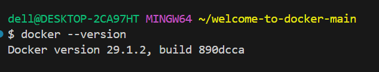

docker info
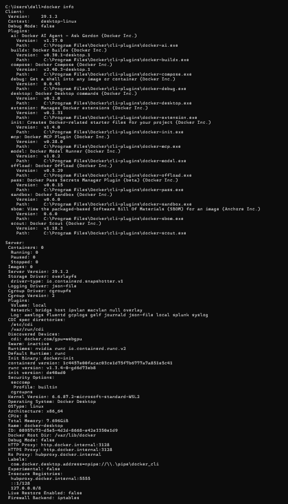
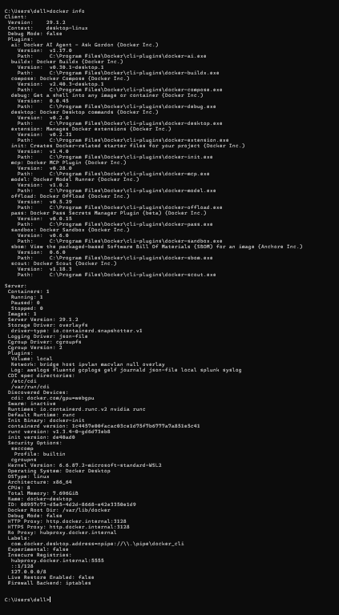

docker ps
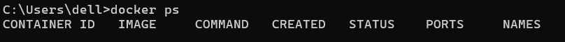
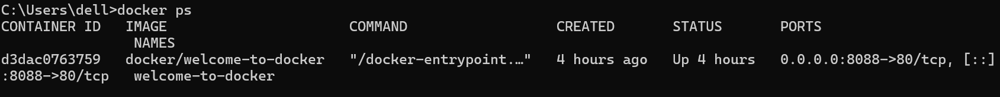

docker images

docker pull
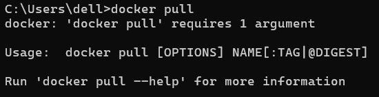
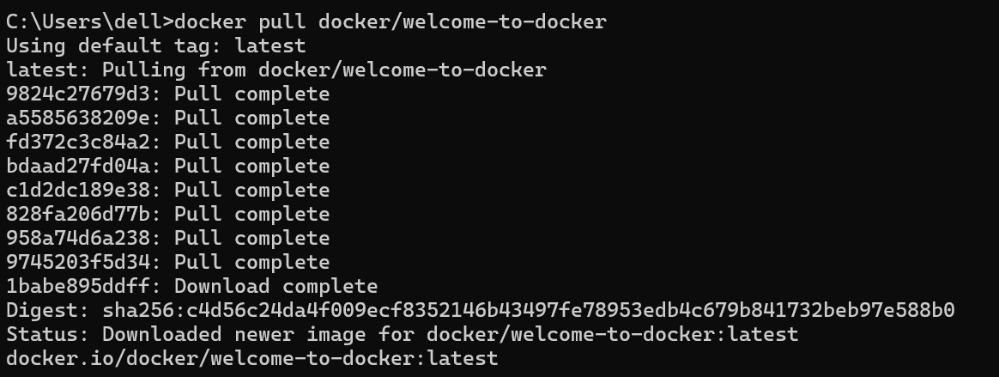

docker rm container specific
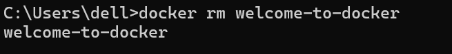

docker rmi
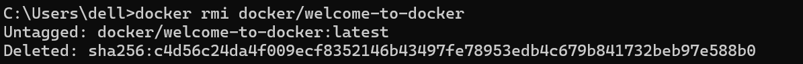

docker run
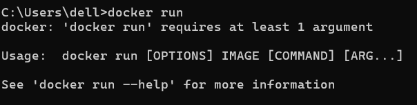
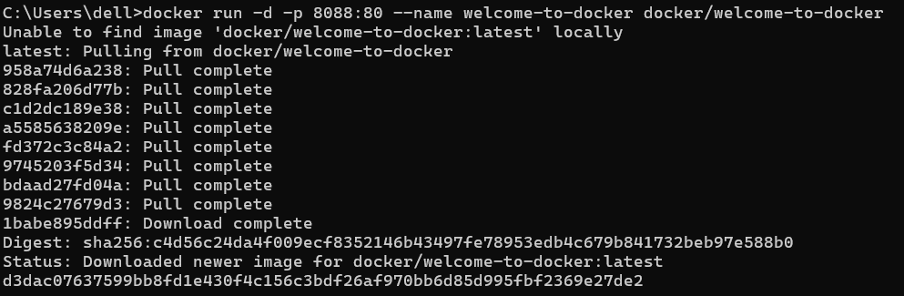

docker results

docker stop
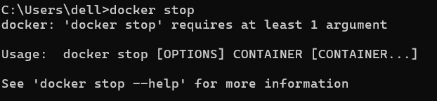
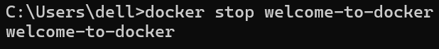

docker prune container
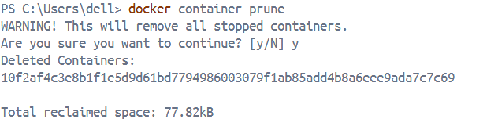

docker forced shut down and delete container
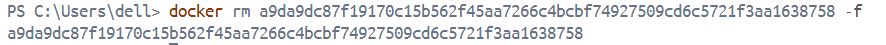

docker forced delete image
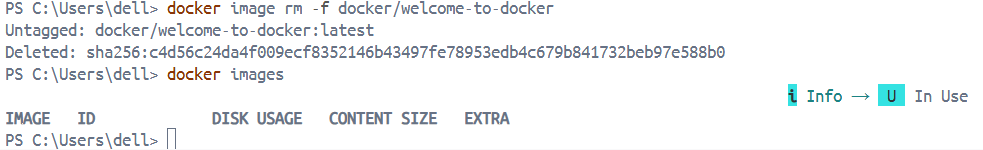

docker delete unused images
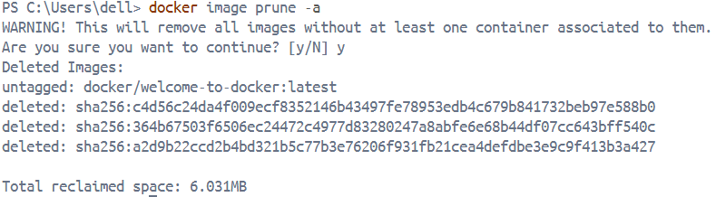
