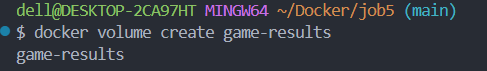
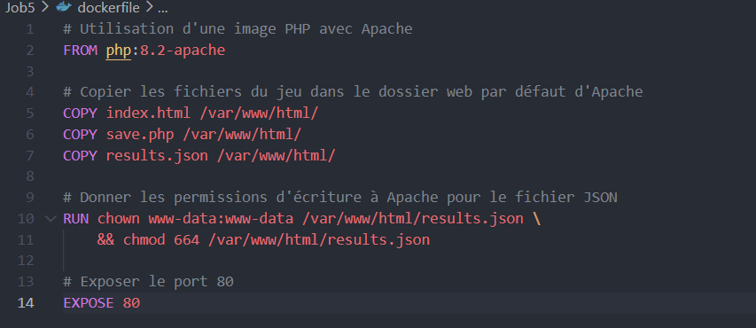
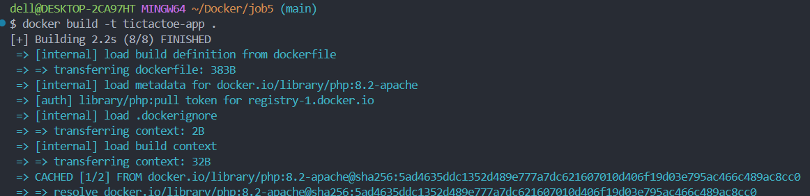
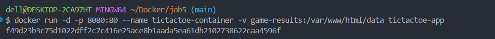
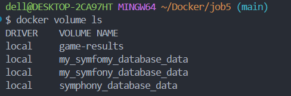
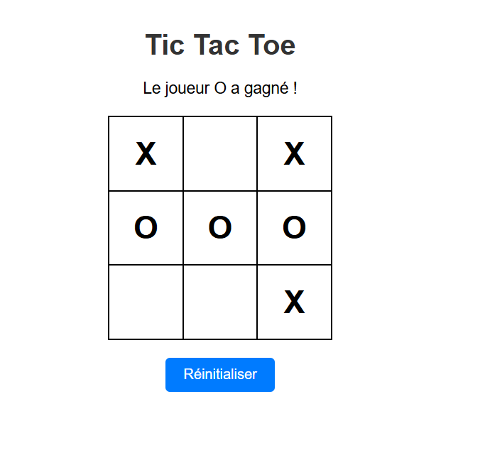
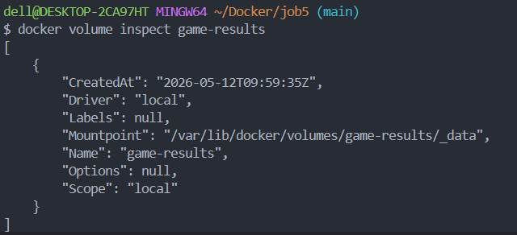
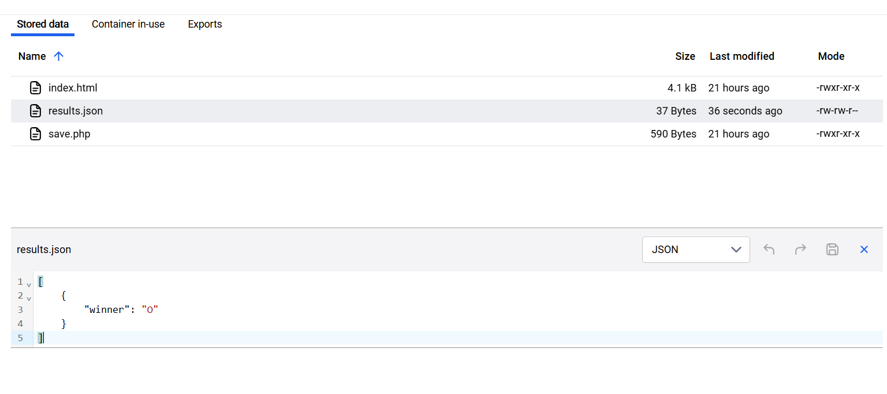
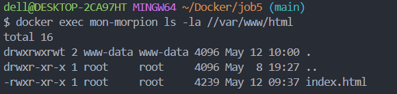
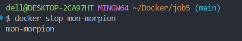

creation du volume pour les resultats

dockerfile

docker build

docker run

pour voir les different volumes

tic-tac-toe

results partie

check pour voir le contenue du container

docker stop

